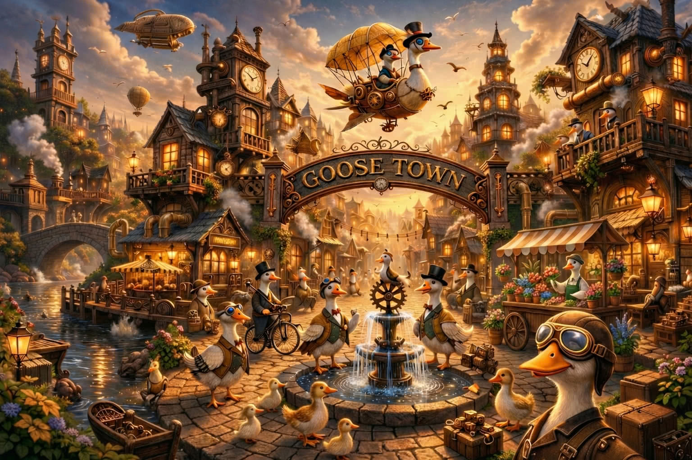

# Welcome to Goosetown!

<p align="center">
  
</p>

<p align="center"><em>A tiny town that ships.</em></p>

<p align="center">
  <a href="#quick-start">Quick Start</a> ·
  <a href="docs/INSTALL.md">Install</a> ·
  <a href="docs/USAGE.md">Usage</a> ·
  <a href="docs/DASHBOARD.md">Dashboard</a> ·
  <a href="docs/GTWALL.md">Town Wall</a> ·
  <a href="docs/TROUBLESHOOTING.md">Troubleshooting</a>
</p>

<p align="center">
  <a href="https://github.com/aaif-goose/goosetown/actions/workflows/test.yml"></a>
  <a href="LICENSE"></a>
  <a href="https://discord.gg/goose-oss"></a>
</p>

Goosetown coordinates flocks of AI agents — researchers, writers, workers, reviewers — so you describe what to build and the town builds it. Research-first, parallel by default, with crossfire reviews across multiple models.

## Quick Start

You'll need [goose](https://github.com/block/goose/releases) v1.25.0+ on your `PATH`, plus [uv](https://docs.astral.sh/uv/) if you want the dashboard. macOS or Linux. Full requirements: [docs/INSTALL.md](docs/INSTALL.md).

```bash
# 1. Clone and enter
git clone https://github.com/aaif-goose/goosetown.git
cd goosetown

# 2. Launch goose through the wrapper
#    (sets up per-session telepathy + Town Wall files)
./goose
```

Then, at the goose prompt:

```
Load the goosetown-orchestrator skill, then build me a small TODO CLI in Rust.
```

The orchestrator will spawn researchers to scout patterns, dispatch workers to write code in parallel, and run a crossfire review before handing back the result.

> [!NOTE]
> On first run, goose may ask you to set environment variables (API keys, model providers). Follow its prompts and re-run `./goose`.

Want a desktop GUI instead of the terminal? Use `./goose_gui` — see [docs/INSTALL.md#gui-vs-cli](docs/INSTALL.md#gui-vs-cli).

## See It Work

Open a second terminal and tail the Town Wall while the flock runs:

```
[16:21:41] <orchestrator>       Spawning research flock...
[16:22:06] <researcher-local>   💡 Found existing patterns in GUIDES/
[16:22:19] <researcher-github>  🎬 Scanning issues and PRs
[16:23:46] <orchestrator>       Research complete. Dispatching workers...
[16:24:11] <worker-auth>        🎬 Claiming src/auth/mod.rs
[16:25:02] <reviewer-gpt5>      ✅ APPROVE (9/10)
```

Or launch the real-time dashboard (yes, they're actual geese on a map):

```bash
./dashboard --open
```

<p align="center">
  
</p>

Full dashboard reference: [docs/DASHBOARD.md](docs/DASHBOARD.md).

## How It Works

The orchestrator decomposes your request into phases — research, build, review — and dispatches parallel delegates called *flocks* that coordinate through the Town Wall.

```
        Orchestrator
            │ spawns
     ┌──────┼──────┐
     ▼      ▼      ▼
 Researchers (flock)      ← share findings via gtwall
            │ synthesize
     ┌──────┼──────┐
     ▼      ▼      ▼
 Workers + Writers        ← parallel execution
            │ review
     ┌──────┼──────┐
     ▼      ▼      ▼
 Reviewers (crossfire)    ← multi-model adversarial QA
            │
     Final deliverable
```

When three or more delegates share a task and coordinate via gtwall, that's a *flock*.

## Core Concepts

- **Orchestrator** — the main session; decomposes work, dispatches delegates, synthesizes results
- **Delegates** — parallel subagents: researchers, writers, workers, reviewers
- **Skills** — role definitions loaded into each delegate at spawn (the ones in `.claude/skills/` ship with the repo)
- **gtwall** — the Town Wall; broadcast channel for real-time delegate coordination (see [docs/GTWALL.md](docs/GTWALL.md))
- **Telepathy** — orchestrator → delegate push messages for urgent paging

## Documentation

| Doc | What's in it |
| --- | --- |
| [docs/INSTALL.md](docs/INSTALL.md) | System requirements, installing goose + uv, GUI vs CLI, env vars, first-run setup |
| [docs/USAGE.md](docs/USAGE.md) | What to type once goose starts, example prompts, the working directory layout, skills you can call out by name |
| [docs/DASHBOARD.md](docs/DASHBOARD.md) | `./dashboard` commands, ports, multi-instance behavior, what the village view shows |
| [docs/GTWALL.md](docs/GTWALL.md) | Using `./gtwall` as a human operator to watch or post to the wall |
| [docs/TROUBLESHOOTING.md](docs/TROUBLESHOOTING.md) | Common errors and fixes |
| [AGENTS.md](AGENTS.md) | Reference for agents running *inside* a goose session (skill loading, wall protocol, knowledge files) |
| [CONTRIBUTING.md](CONTRIBUTING.md) | Setting up a dev environment and submitting changes upstream |

## Acknowledgments

Goosetown was inspired by [Gas Town](https://github.com/gastownhall/gastown), the multi-agent coordination framework created by [Steve Yegge](https://en.wikipedia.org/wiki/Steve_Yegge). His [blog post announcing Gas Town](https://steve-yegge.medium.com/welcome-to-gas-town-4f25ee16dd04) laid out the vision of orchestrating flocks of AI agents — researchers, workers, reviewers — that Goosetown builds on.

---

Part of the [goose](https://github.com/block/goose) ecosystem by [Block](https://block.xyz).

[Apache 2.0 License](LICENSE)
