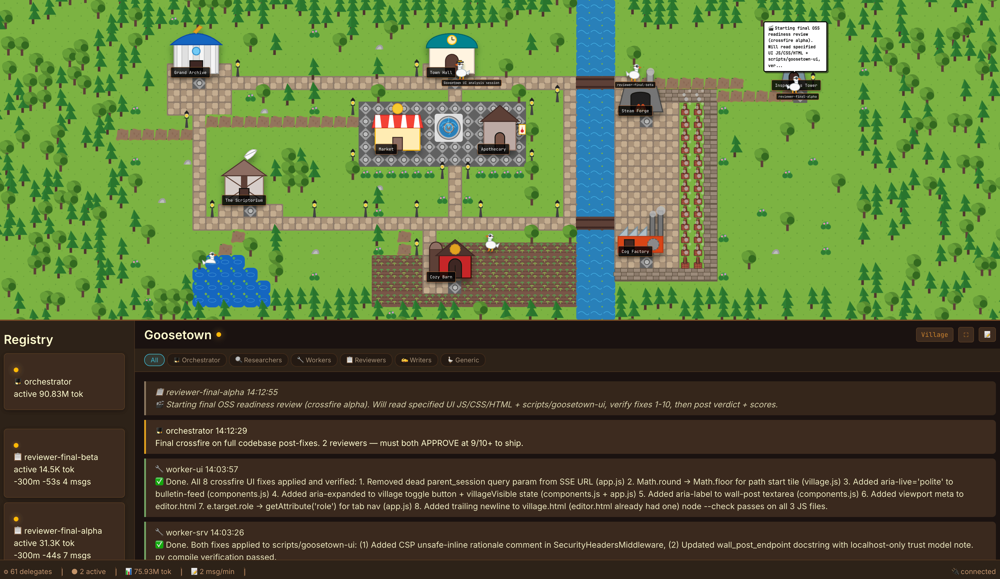

# Dashboard

The Goosetown dashboard is a local web UI that visualizes your orchestrator session in real time — geese on a map, the Town Wall, delegate status, and live event stream. It's optional; everything works without it.

<p align="center">
  
</p>

## Prerequisites

- An active goose session launched via `./goose` (so `GOOSE_GTWALL_FILE` is set)
- [uv](https://docs.astral.sh/uv/) installed and on `PATH`
- `screen`, `lsof`, `curl`, `sqlite3` (see [INSTALL.md](INSTALL.md#system-requirements))

## Commands

Run from the repo root, in any shell that has `GOOSE_GTWALL_FILE` exported (in practice: the same terminal you ran `./goose` in, or another shell with the env var copied over).

```bash
./dashboard           # Launch (idempotent). Prints port on stdout.
./dashboard --open    # Launch + open in your browser
./dashboard --status  # Check if running. Prints port + exits 0 if yes, exit 1 if no.
./dashboard --stop    # Stop this instance
./dashboard --help    # Full help
```

The `dashboard` script is **idempotent** — calling it twice doesn't launch a second copy; the second call just reports the port of the existing one.

### Quickest path: from inside goose

You don't have to leave your goose session to launch it. Just ask:

```
Launch the dashboard and open it in my browser.
```

The orchestrator runs `./dashboard --open` for you.

## How it Finds Your Session

The dashboard scopes itself to a single goose session in two ways:

1. **The Town Wall file** — `GOOSE_GTWALL_FILE` identifies *which* goose instance to attach to. The dashboard reads the wall file directly for live messages.
2. **The session ID** — by default, the dashboard queries `~/.local/share/goose/sessions/sessions.db` to find the most-recently-active orchestrator session (one that has spawned background delegates). Override with `AGENT_SESSION_ID=...` if you want to pin it.

## Multiple Instances

Run two `./goose` sessions in two terminals and you can run two dashboards — one per session — without interference:

```bash
# Terminal A
./goose         # gets wall-1234-5678.log
./dashboard     # binds 127.0.0.1:4242

# Terminal B
./goose         # gets wall-1235-9012.log
./dashboard     # binds 127.0.0.1:4243
```

Each dashboard:

- Has its own `screen` session named `goosetown-ui-<WALL_ID>`
- Writes its own portfile at `~/.goosetown/walls/dashboard-<WALL_ID>.port`
- Picks the first free port in the range `4242–4300`
- Only stops its own process when you run `--stop`. There's no global "kill all" — instances never step on each other.

## Ports

The dashboard probes ports `4242` through `4300` and grabs the first free one. If all 59 ports are taken (you have a *lot* of goose sessions, or some other process is squatting), launch fails with exit code `3`.

## Security

The dashboard binds to `127.0.0.1` by default and has **no authentication, no CORS, and no access control**. It is designed exclusively for localhost use.

You can change the bind host with the `GOOSETOWN_BIND_HOST` env var — for example, to expose it to a remote SSH tunnel:

```bash
GOOSETOWN_BIND_HOST=0.0.0.0 ./dashboard
```

> [!CAUTION]
> Setting `GOOSETOWN_BIND_HOST` to anything other than `127.0.0.1` exposes all of your session's wall messages, delegate prompts, and goose conversation snippets to whoever can reach that port. Only do this on a trusted network, ideally behind an SSH tunnel or VPN, and never on a public-facing host.

## Exit Codes

| Code | Meaning |
| --- | --- |
| `0` | Success |
| `1` | Generic error / not running (from `--status`) |
| `2` | Config error — `GOOSE_GTWALL_FILE` not set, or no session found |
| `3` | Port range `4242–4300` exhausted |
| `4` | Dashboard process didn't become reachable within 5s |

## Troubleshooting

**"GOOSE_GTWALL_FILE not set"** — you're running `./dashboard` in a shell that never launched `./goose`. Either launch goose in this shell first, or copy the env var from your goose terminal: `export GOOSE_GTWALL_FILE=...`.

**"No session found"** — goose hasn't created a session yet, or `~/.local/share/goose/sessions/sessions.db` doesn't exist. Have at least one exchange in your goose chat, then retry.

**Dashboard shows old data** — it's probably attached to the wrong session. Pin it explicitly with `AGENT_SESSION_ID=<id> ./dashboard`. Get the ID from the sessions DB or from goose itself.

**Port already in use** — another instance of the dashboard exists. Run `./dashboard --status` to see if it's yours. If the portfile is stale (process died), delete `~/.goosetown/walls/dashboard-*.port` and retry.

More fixes in [TROUBLESHOOTING.md](TROUBLESHOOTING.md).
